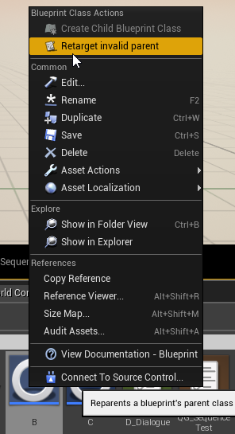
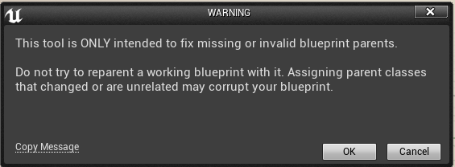
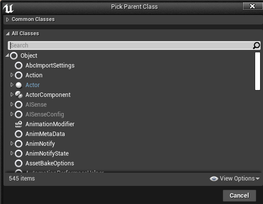

# Blueprint Retarget plugin
An small tool that allows retargeting invalid blueprints when its parent class is missing on UE4

## When to Use
Use this tool when a blueprint has a missing parent class (and therefore you can't open it).

This can happen when:
- It's parent C++ class has been renamed, changed its module or is missing for any other reason.
- It's parent Blueprint class has been lost but still exists somewhere.

Only retarget classes with their original, not modified, parent classes.

### This is not a magic fix button

It won't fix references and blueprints could still fail if the parent has changed or if anything else is corrupted.

**Use it only when the parent class is missing.**

## Usage

1. When having an invalid blueprint, right click on it to see *"Retarget invalid parent"*

 

2. After this, a warning will pop up... to warn you

3. Finally, select the missing parent from the list. The blueprint will be reparented and you should be able to use it again.

